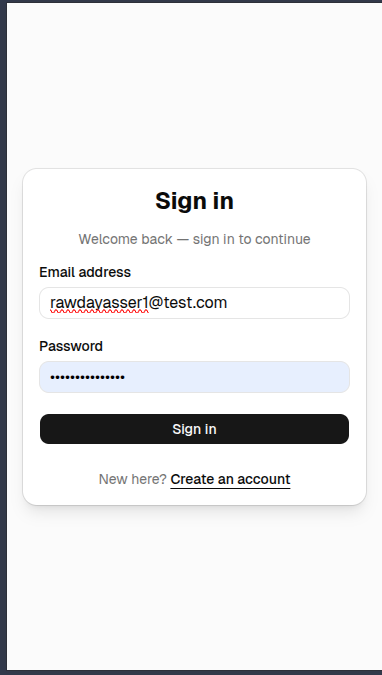
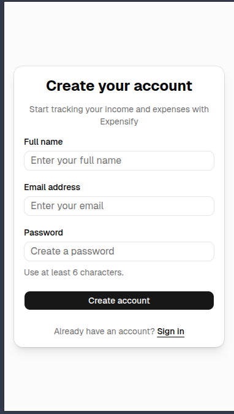
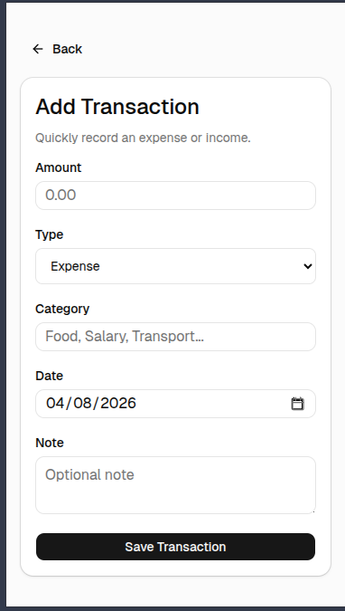
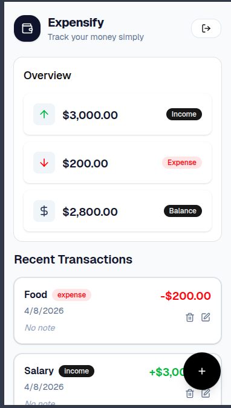
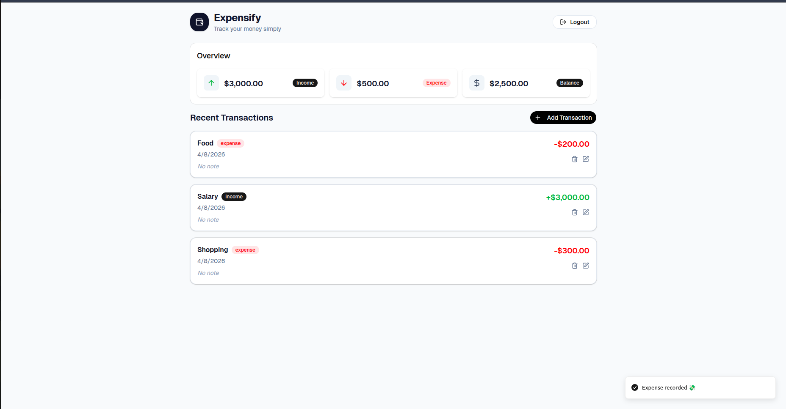
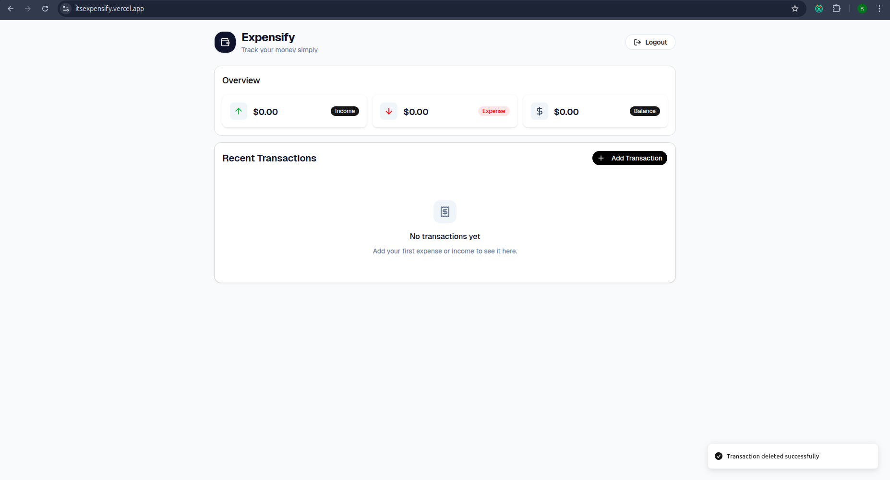
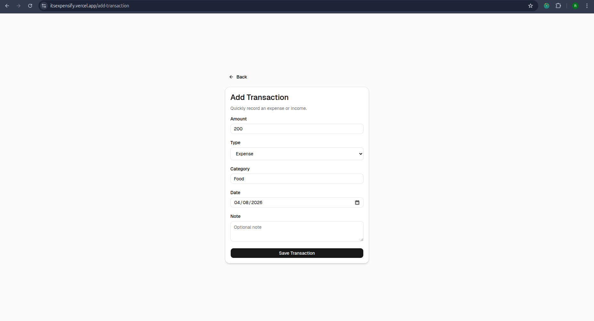

# 💸 Expensify - Simple Money Tracker

> A mobile-first, full-stack personal finance tracker designed to help you monitor your income, expenses, and overall balance effortlessly.

## ✨ Features

- **Secure Authentication:** Full user registration, login, and secure sessions.
- **Transaction Management:** Full CRUD (Create, Read, Update, Delete) capabilities for your daily transactions.
- **Smart Dashboard:** Real-time calculation of total income, total expenses, and current balance.
- **Mobile-First Design:** A highly responsive, clean, and modern UI optimized for smaller screens.

## 🛠️ Tech Stack

- **Frontend:** React, Tailwind CSS, shadcn/ui
- **Backend:** Node.js, Express.js
- **Database:** MongoDB (with Mongoose aggregation pipelines)
- **Development Environment:** Ubuntu, VSCode, GitHub Copilot

## Demo

https://itsexpensify.vercel.app/

## Screenshots

<p align="center">

<br/>

<br/>

<br/>

<br/>

<br/>
<br/>

</p>

## 🚀 Getting Started

To get a local copy up and running, follow these simple steps.

### Prerequisites

- Node.js installed
- A MongoDB URI (local or Atlas)

### Installation

1. Clone the repo

   ```sh
   git clone https://github.com/rawdaymohamed/Expensify.git
   ```

2. Navigate to the project directory
   ```sh
   cd Expensify
   ```
3. Install dependencies for both client and server
   ```sh
   cd server
   npm install
   cd ../client
   npm install
   ```
4. Create a `.env` file in the root directory and add your MongoDB URI
   ```env
   MONGO_URI=your_mongodb_uri_here
   ```
5. Start the development server
   ```sh
   npm run dev
   ```
6. Open your browser and navigate to `http://localhost:5173` to see the app in action!
